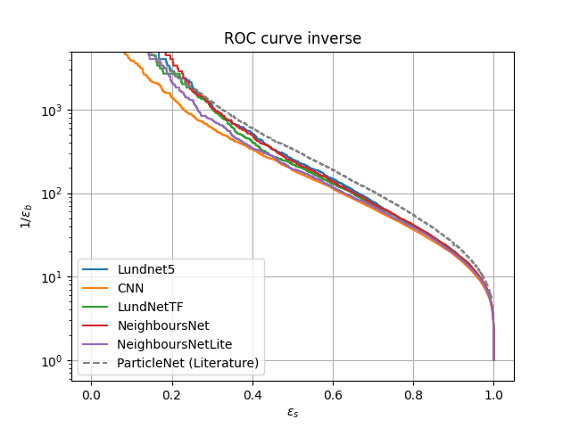

# Searchinng for new Physics at the LHC with Machine Learning

In this work 3 different types of models are presented. This models are specified for a binary classification between 2 diffetent types of jets (Quantum chromodynamics and top jets). The task is to create a classifier, to be able differ between the background (QCD-jets) and signal (top-jets), which could result into finiding new Physics Beyond Standard Model (BSM). The paper with a detailed explanation can be found [here](https://github.com/mackostya/ml-for-lhc-jets/blob/main/Searching_for_new_physics_at_the_LHC_with_Machine_Learning.pdf).

The 3 models implemented in this work are:
- **CNN** (Convolutional Neural Network) - trains on representation of jets as 40x40 images.
- **AE** (Autoencoder) - trains on the background (QCD) 40x40 images. Afterwards both signal and background are passed to the model. The reconstruction of the signal is expected to be less efficient, because the model was trained on the background.
- **edgeConvNet** - trains on the reclustered jets. This model is modified from [here](https://github.com/hqucms/ParticleNet). For this particular network firstly a reclustering with Cambridge/Aachen algorithm is performed on a raw data with a fastjet implementation. Afterwards a stack of EdgeConvBlocks is used in the network as the key architectural structure.

The resulted ROC curves with a comparison to some of the models from literature are shown in the following picture:

